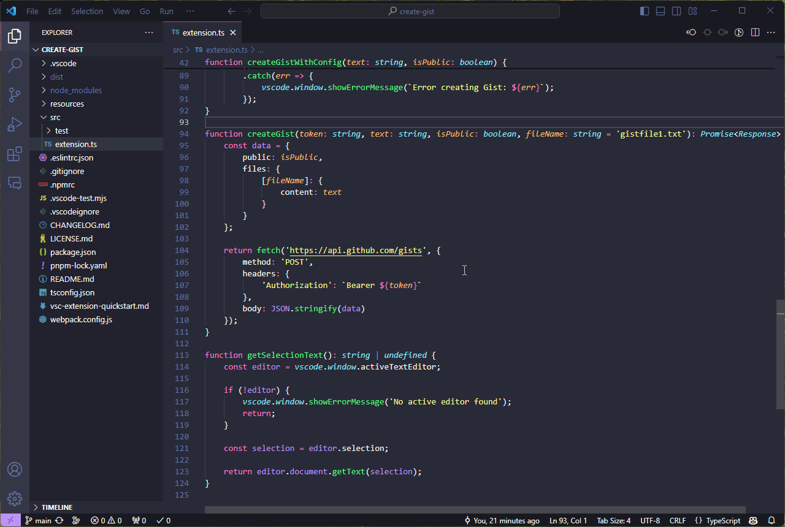

# Create Gist
Upload your code to Gist with ease

## Installation
- Install via Visual Studio Code extensions. Search for `Create Gist`.
- Install via the [Visual Studio Code Marketplace](https://marketplace.visualstudio.com/items?itemName=wiinter.create-gist).

## Extension Settings

The following settings are supported:
* `create-gist.token`: GitHub Personal Access Token (required)
* `create-gist.gistVisibility`: Gist visibility (secret, public)
* `create-gist.menuMode`: Menu mode (default, submenu, both)
* `create-gist.includeFileName`: Include file name in Gist
* `create-gist.copyToClipboard`: Copy Gist URL to clipboard
* `create-gist.showNotification`: Show notification after creating Gist

## License
MIT, See [LICENSE](./LICENSE) for more information.